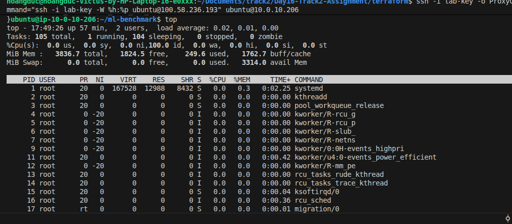
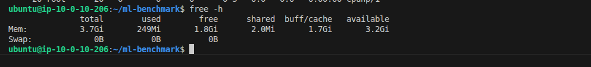
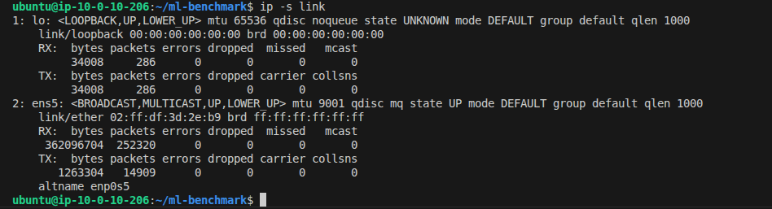
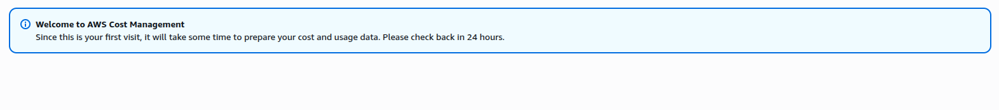

# BÁO CÁO KẾT QUẢ LAB 16: BENCHMARK LIGHTGBM TRÊN AWS CPU NODE

## 1. Kết quả Benchmark chi tiết
- **Thời gian load data**: 2.4861 giây
- **Thời gian training**: 1.5017 giây
- **Số vòng lặp tối ưu (Best iteration)**: 1
- **AUC-ROC**: 0.95165
- **Accuracy**: 0.99895 (99.89%)
- **F1-Score**: 0.72727
- **Precision**: 0.65574
- **Recall**: 0.81633
- **Inference latency (1 mẫu)**: 1.8021 ms
- **Inference throughput (1000 mẫu)**: 457,893.45 mẫu/giây

## 2. Báo cáo nhận xét kết quả (5-10 dòng)
Mô hình LightGBM khi huấn luyện và suy luận trên CPU instance (`t3.medium`) cho hiệu năng vượt trội: thời gian load dữ liệu mất ~2.49s và thời gian huấn luyện cực kỳ nhanh chỉ ~1.50s cho toàn bộ 284,807 dòng dữ liệu giao dịch thẻ tín dụng. Mô hình đạt chỉ số AUC-ROC rất cao (0.95165) cùng Accuracy 99.89% và Recall 81.63%, chứng minh khả năng phát hiện các giao dịch gian lận nhạy bén ngay cả trên tập dữ liệu mất cân bằng nghiêm trọng (imbalanced dataset). Về mặt inference, độ trễ cho mỗi giao dịch đơn lẻ chỉ vỏn vẹn ~1.80ms và throughput xử lý theo lô đạt hơn 457,000 giao dịch/giây, chứng minh rằng với các bài toán Tabular Data, việc tối ưu hóa thuật toán Gradient Boosting trên CPU thông thường mang lại hiệu quả chi phí và tốc độ hoàn toàn áp đảo so với việc đầu tư cụm GPU đắt đỏ.

## 3. Danh mục các tài liệu & minh chứng nộp bài (Deliverables)
1. **File metrics**: File [`benchmark_result.json`](file:///home/hoangduc/Documents/track2/Day16-Track2-Assignment/benchmark_result.json) lưu tại thư mục gốc dự án.
2. **Mã nguồn Terraform**: File nén [`terraform_submission.tar.gz`](file:///home/hoangduc/Documents/track2/Day16-Track2-Assignment/terraform_submission.tar.gz) chứa toàn bộ cấu hình hạ tầng đã chạy thành công.

---

## 4. Hình ảnh minh chứng (Screenshots)

### 4.1. Kiểm tra tài nguyên hệ thống (CPU, RAM, Network)

#### CPU Usage (`top`)

#### RAM Usage (`free -h`)

#### Network Usage (`ip -s link`)

---

### 4.2. Hóa đơn & Chi phí (AWS Billing / Cost Management)

